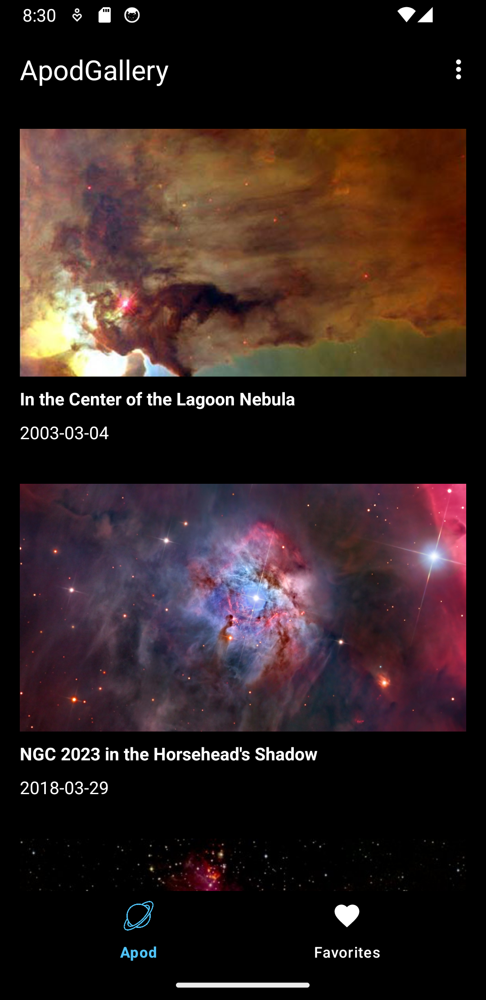
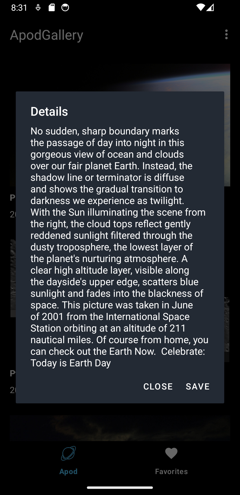
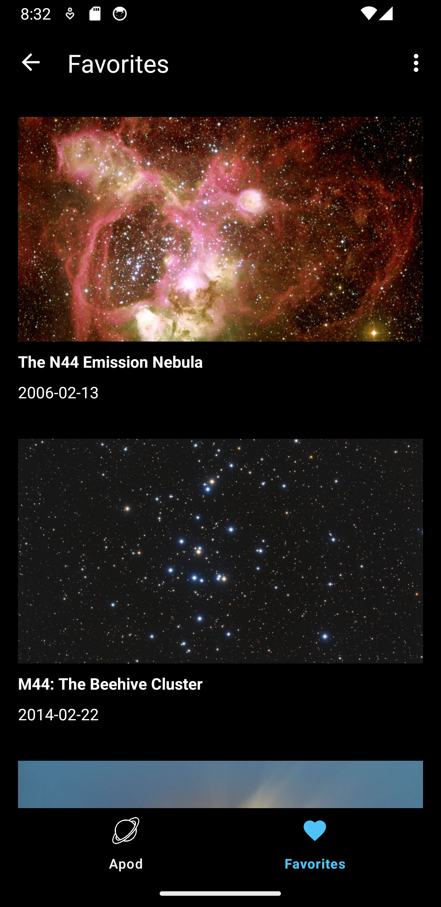

<h1 align="center">ApodGallery</h1>

<p align="center">
  <a href="https://opensource.org/licenses/Apache-2.0"></a>
  <a href="https://android-arsenal.com/api?level=21"></a>
  <br>
  <a href="https://wa.me/+5511986726064"></a>
  <a href="https://www.linkedin.com/in/jhonybguerra/"></a>
  <a href="mailto:jhonybguerra@gmail.com"></a>
</p>

<p align="center">  

⭐ Esse é um projeto para demonstrar meu conhecimento técnico no desenvolvimento Android nativo com Kotlin. Mais informações técnicas abaixo.

🛰️ Aplicativo que acessa a API APOD da NASA, apresentando uma seleção aleatória de imagens astronômicas diárias, permitindo aos usuários salvar e gerenciar suas favoritas em um banco de dados integrado.

</p>

</br>

<p float="left" align="center">



</p>

## Download
<a href='https://play.google.com/store/apps/details?id=com.jbgcomposer.apodgallery'></a>

Ou faça o download da <a href="apk/app-debug.apk?raw=true">APK diretamente</a>. Você pode ver <a href="https://www.google.com/search?q=como+instalar+um+apk+no+android">aqui</a> como instalar uma APK no seu aparelho android.

## Tecnologias usadas e bibliotecas de código aberto

- Minimum SDK level: 24
- [Linguagem Kotlin](https://kotlinlang.org/)
- Navigation, BottomNavigation e Fragments
- Injeção de dependência com Hilt
- Utilização de Repository
- Operações assíncronas com Coroutines
- Consumo de API REST com Retrofit
- Integração com banco de dados Room
- Implementação de testes unitários com JUnit e Mockito


- Jetpack

  - ViewBinding: Liga os componentes do XML no Kotlin através de uma classe que garante segurança de tipo e outras vantagens.
  - RoomDatabase: Integração com banco de dados e operações assíncronas com Threads
  - Navigation: Facilita a navegação e passagem de dados entre os fragmentos, melhorando a organização e a experiência do usuário em aplicativos Android.
  - Retrofit: Biblioteca para chamadas de API, permite fácil integração e manipulação de dados de web services, otimizando a comunicação com servidores.

  
- Arquitetura
  - **ApodGallery** foi construído em MVP (Model-View-Presenter): Este padrão arquitetural separa a lógica de negócios, gerida pelo Presenter, da lógica de apresentação, executada pela View. No aplicativo, o Presenter administra as interações com o modelo de dados e a API, enquanto a View se dedica a exibir os dados e a interagir com o usuário, otimizando a manutenção e os testes do aplicativo.

## Features

### Tela inicial com resultado da busca da API e ação de salvar imagens favoritas.


Ao clicar em algum item da lista, um Dialog é aberto, exibindo uma descrição da imagem e a opção de salvar em um banco de dados.

### Navegação e remoção do item salvo


Ao clicar em algum item da lista, um Dialog é aberto, exibindo uma descrição da imagem e a opção de remover do banco de dados.

# Licença

```xml
Copyright [2023] [Jhony Bossolane Guerra]

   Licensed under the Apache License, Version 2.0 (the "License");
   you may not use this file except in compliance with the License.
   You may obtain a copy of the License at

     http://www.apache.org/licenses/LICENSE-2.0

   Unless required by applicable law or agreed to in writing, software
   distributed under the License is distributed on an "AS IS" BASIS,
   WITHOUT WARRANTIES OR CONDITIONS OF ANY KIND, either express or implied.
   See the License for the specific language governing permissions and
   limitations under the License.

```
